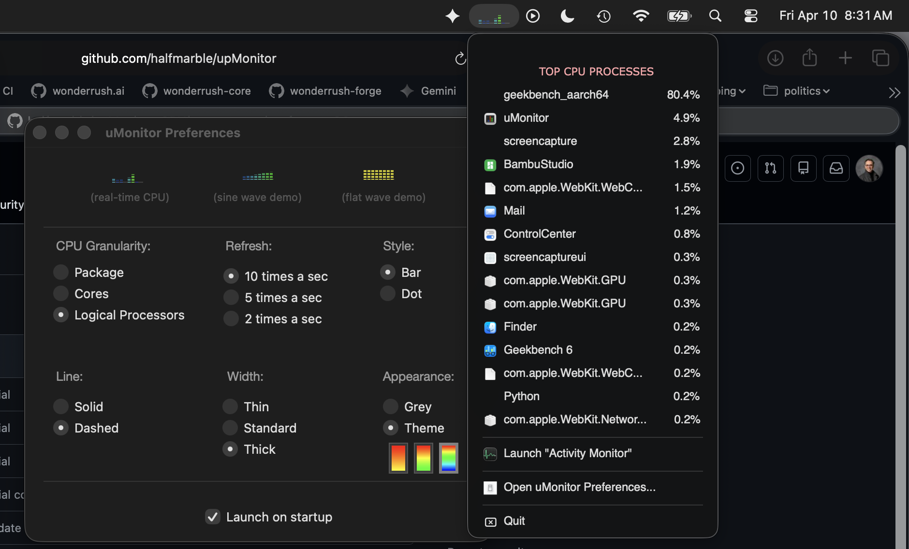

# upMonitor

A lightweight, highly customizable CPU monitoring tool designed specifically for the macOS menu bar. Keep a pulse on your system performance without cluttering your workspace.

* **hiding in the menu bar:**

* **showing preferences and processes:**

## 🚀 Features

`upMonitor` provides real-time insights into your system's CPU usage with a focus on aesthetics and customization.

* **Real-time Menu Bar Visualization:** View your CPU activity at a glance with a live-updating graph right in your macOS menu bar.
* **Top Process Tracking:** Quickly identify which applications are consuming the most resources with a ranked list of "Top CPU Processes."
* **Highly Customizable:**
    * **Granularity:** Monitor at the Package, Core, or Logical Processor level.
    * **Refresh Rates:** Choose between 2, 5, or 10 updates per second for ultra-responsive feedback.
    * **Visual Styles:** Switch between Bar and Dot styles to match your preference.
    * **Appearance:** Choose from various color themes (including vibrant gradients) or a classic grey look.
    * **Line Weights:** Adjust thickness and choose between solid or dashed lines.
* **System Integration:** * One-click access to the macOS native **Activity Monitor**.
    * **Launch on Startup** support to keep it running whenever you use your Mac.

## 🛠 Installation

1.  Download the latest release from the [Releases](https://github.com/halfmarble/upMonitor/releases) page.
2.  Drag `upMonitor.app` to your `/Applications` folder.
3.  Launch the app and look for the activity graph in your menu bar!

## ⚙️ Configuration

To customize your experience:
1.  Click on the `upMonitor` icon in the menu bar.
2.  Select **Open uMonitor Preferences...**
3.  Adjust the settings to fit your workflow.

## 🤝 Contributing

Contributions are welcome! Whether it's reporting a bug, suggesting a feature, or submitting a pull request, feel free to get involved.

1.  Fork the Project
2.  Create your Feature Branch (`git checkout -b feature/AmazingFeature`)
3.  Commit your Changes (`git commit -m 'Add some AmazingFeature'`)
4.  Push to the Branch (`git push origin feature/AmazingFeature`)
5.  Open a Pull Request

## 📄 License

Distributed under the MIT License. See `LICENSE` for more information.

---
Created with ❤️ by [halfmarble](https://github.com/halfmarble)
